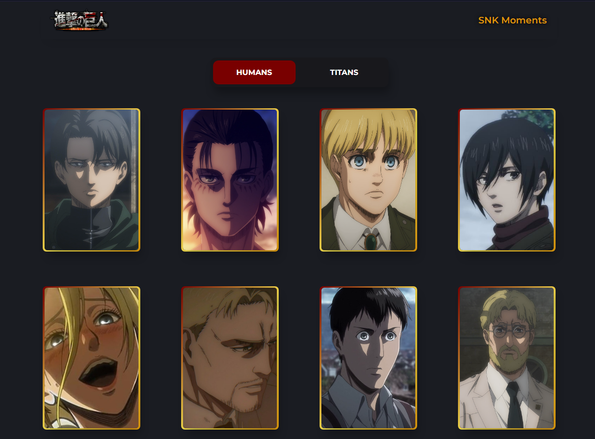

# SNK PROJECT

## Table of contents

- [Preview](#preview)
  - [The challenge](#the-challenge)
  - [Links](#links)
- [My process](#my-process)
  - [Built with](#built-with)
  - [What I learned](#what-i-learned)
  - [Continued development](#continued-development)
  - [Useful resources](#useful-resources)
- [Author](#author)

## Preview

### Screenshot

## The challenge

In this project you will see the the best moments of each SNK character, making use of its API:

- View the
- 
- **Bonus**: Have the correct color scheme chosen for them based on their computer preferences. _Hint_: Research `prefers-color-scheme` in CSS.

### Links
- API: [API](https://attackontitanapi.herokuapp.com/)
- Solution URL: [Solution](https://github.com/fabioalcocer/api-magic-snk)
- Live Site URL: [Live](https://fabioalcocer.github.io/api-magic-snk/)

## My process

### Built with

- HTML5 markup
- Mobile-first workflow
- Responsive Design
- Grid Layout
- SASS Modules
- Vanilla Javascript
- Fetch
- AOS Library

### What I learned

In this project I learned how to handle asynchronous requests, data manipulation through an API, the correct use of async and await. How to implement animation libraries like AOS, creating loadings only with CSS. And the correct structuring of modules in SASS.

### Useful resources

- [AOS Library](https://michalsnik.github.io/aos/)
- [Property](https://developer.mozilla.org/en-US/docs/Web/CSS/@property)
- [MDN Web Docs](https://developer.mozilla.org/es/docs/Web)

## Author
### Fabio Alcocer Sejas
- Twitter - [@alcocerSejas](https://twitter.com/AlcocerSejas)
- LinkedIn - [@fabioalcocer](https://www.linkedin.com/in/fabio-alcocer/)
- GitHub - [@fabioalcocer](https://github.com/fabioalcocer/)